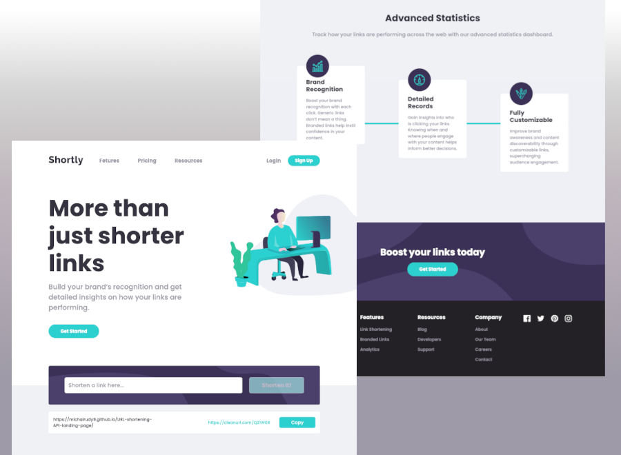

# Frontend Mentor - Shortly URL shortening API Challenge solution

This is a solution to the [Shortly URL shortening API Challenge challenge on Frontend Mentor](https://www.frontendmentor.io/challenges/url-shortening-api-landing-page-2ce3ob-G). Frontend Mentor challenges help you improve your coding skills by building realistic projects. 

## Table of contents

- [Overview](#overview)
  - [The challenge](#the-challenge)
  - [Screenshot](#screenshot)
  - [Links](#links)
- [My process](#my-process)
  - [Built with](#built-with)
  - [What I learned](#what-i-learned)
- [Run project](#run-project)  
- [Author](#author)

## Overview

### Application possibilities

Users is able to:

- View the optimal layout for the site depending on their device's screen size
- Shorten any valid URL
- See a list of their shortened links, even after refreshing the browser
- Copy the shortened link to their clipboard in a single click
- Receive an error message when the `form` is submitted if:
  - The `input` field is empty

### Screenshot



### Links

- Solution URL: [GitHub](https://github.com/michalrudy9/URL-shortening-API-landing-page)
- Live Site URL: [GitHub Pages](https://michalrudy9.github.io/URL-shortening-API-landing-page/)

## My process

### Built with

- Semantic HTML5 markup
- SCSS custom properties
- Flexbox and Grid layout
- Mobile-first workflow
- [Node.js](https://nodejs.org/en)
- [Angular v17](https://angular.dev)
- [Angular CLI](https://angular.io/cli)
- [Bootstrap v5.3](https://getbootstrap.com/docs/5.3/getting-started/introduction/)
- [Clean URI API](https://cleanuri.com/docs)
- [Crypto-JS v4.2](https://www.npmjs.com/package/crypto-js)
- [Ngx Skeleton Loader v8.1](https://www.npmjs.com/package/ngx-skeleton-loader)
- [RxJS v7.8](https://rxjs.dev)
- [Animate On Scroll Library](https://michalsnik.github.io/aos/)
- [Clipboard v17.0](https://material.angular.io/cdk/clipboard/overview)
- [Angular Signals](https://angular.dev/guide/signals)
- [Local Storage](https://developer.mozilla.org/en-US/docs/Web/API/Window/localStorage)

### What I learned

#### Angular Signals

I have learned principle of signals operation in Angular, how declare signals, how to set or update value of signal and to pass signals to component. I also gaind knowledge how display signal value in component template.

`Service`
```ts
private urls: WritableSignal<Url[]>;
```
```ts
constructor() {
  this.urls = signal<Url[]>([]);
}
```
```ts
this.urls.update((elements: Url[]) => [...elements, shortenedUrl]);
```
`Component`
```ts
protected urls!: Signal<Url[]>;
```
```ts
ngOnInit(): void {
  this.urls = this.urlService.getUrls();
}
```
```ts
@for (url of urls(); track url.baseUrl) {
  {{ url.baseUrl }}
  {{ url.shortenedUrl }}
}
```


#### Solving the Angular CORS problem

To fix the CORS error, you need to add a proxy configuration file to src directory in project.
`proxy.conf.json`
```json
{
  "/api": {
    "target": "https://cleanuri.com",
    "secure": true,
    "changeOrigin": true,
    "logLevel": "debug"
  }
}
```
Where `/api` indicate to first subpath name of endpoint. 

`Service`
```ts
this.http.post<PostData>('/api/v1/shorten', body) ...
```
And in service file you type in only further part of url (after domain name) to API.

#### Standalone Components

I have learned working with Angular standalone components and how to import necessary modules to component.

#### Placeholder for loading elements

Also I have learned adding modern placeholder for loading element without content jump effects. To complete I used useful ngx-skeleton-loader library.

#### @if @for @empty directives

```ts
@if (!form.get('url')?.valid && form.get('url')?.touched) {
  Please add a link
} 
```
```ts
@for (url of urls(); track url.baseUrl) { ... }
```
```ts
@empty { ... }
```

#### View children decorator

```ts
@ViewChildren('cb', { read: ElementRef })
private copyButtons!: QueryList<ElementRef>;
```
```html
<button #cb></button>
```

## Run project

This project was generated with [Angular CLI](https://github.com/angular/angular-cli) version 17.0.5.

### Development server

Run `ng serve` for a dev server. Navigate to `http://localhost:4200/`. The application will automatically reload if you change any of the source files.

### Further help

To get more help on the Angular CLI use `ng help` or go check out the [Angular CLI Overview and Command Reference](https://angular.io/cli) page.

## Author

- Frontend Mentor - [@michalrudy9](https://www.frontendmentor.io/profile/michalrudy9)